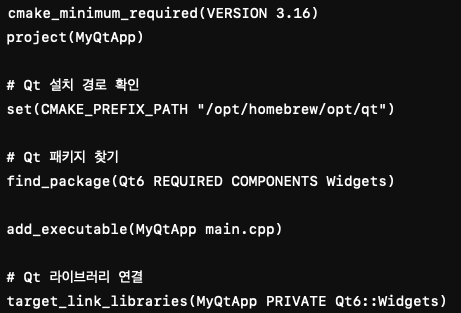

# MAC - QT Environment Setting (in VS Code)

## Install QT
1. Homebrew 설치 
    * 설치 확인 
        - 이미 설치되어 있는지 확인
        - 해당 명령어 터미널에 입력:
            <detail>
            
                brew --version
            </detail>
        - 명령어 입력 후, 버전 명이 표기되면 올바르게 설치된 것

    * 설치 방법 
        - 해당 명령어 터미널에 입력:
            <detail>
            
                /bin/bash -c "$(curl -fsSL https://raw.githubusercontent.com/Homebrew/install/HEAD/install.sh)"
            </detail>
     
2. QT & C++ 개발 환경 설치 
    * 설치 방법 
        - 해당 명령어 순서대로 입력:
            <detail>

                brew install qt cmake ninja
                brew install llvm"  # 최신 clang 컴파일러 설치 (선택 사항)
            </detail>

    * 설치 확인
        - 해당 명령어 각각 입력하여 설치된 버전명이 표기되는지 확인
        - 명령어:
            <detail>

                clang --version
                cmake --version
            </detail>

## Setting VS Code
1. Extension Program 설치
    * C/C++ (Microsoft)
        <detail> 
        
         
        </detail>
    * CMake Tools
    * Qt VSCode Tools (Qt 관련 지원 추가)
    * CodeLLDB (디버깅 지원)

## Setting QT Project 
1. Project Directory 생성 및 이동
    * 예시(터미널 명령어): 
        <detail>
        
            mkdir ~/QtProjects/MyApp
            cd ~/QtProjects/MyApp
        </detail>

2. CMakeLists.txt 파일 생성 및 내용 입력
    * 파일명은 무조건 동일해야 함
    * 해당 파일 내 입력 내용:
        

            cmake_minimum_required(VERSION 3.16)
            project(MyQtApp)

            //Qt 설치 경로 확인
            set(CMAKE_PREFIX_PATH "/opt/homebrew/opt/qt")

            //Qt 패키지 찾기
            find_package(Qt6 REQUIRED COMPONENTS Widgets)

            add_executable(MyQtApp main.cpp)

            //Qt 라이브러리 연결
            target_link_libraries(MyQtApp PRIVATE Qt6::Widgets)
        

3. QT Applcation Code (main.cpp) 파일 생성 및 내용 입력 
    * 파일명 동일하게 권장 (변경 시 다른 파일 내 일부 내용 수정 필요)
    * 해당 파일 내 입력 내용:
        

            #include <QApplication>
            #include <QLabel>

            int main(int argc, char *argv[]) {
                QApplication app(argc, argv);

                QLabel label("Hello, Qt on macOS with VS Code!");
                label.show();

                return app.exec();
            }
        

4. Project Build and Exec
    * Build Directory 생성
        <detail>

            mkdir build
            cd build
        </detail>
    * CMake 실행
        <detail>

            cmake .. -DCMAKE_PREFIX_PATH=$(brew --prefix qt)
            cmake --build .
        </detail>
    * App 실행
        <detail>

            ./MyQtApp
        </detail>

5. Set CMake Build in VS Code
    * .vscode 폴더 생성 후 아래 3가지 파일 추가 
    * .vscode/setting.json
        <detail>

            {
                "cmake.configureSettings": {
                    "CMAKE_PREFIX_PATH": "/opt/homebrew/opt/qt"
                },
                "cmake.generator": "Ninja"
            }
        </detail>
    * .vscode/launch.json
        <detail>

            {
                "version": "0.2.0",
                "configurations": [
                    {
                        "name": "Launch Qt App",
                        "type": "lldb",
                        "request": "launch",
                        "program": "${workspaceFolder}/build/MyQtApp",
                        "args": [],
                        "cwd": "${workspaceFolder}",
                        "environment": [],
                        "externalConsole": false,
                        "MIMode": "lldb"
                    }
                ]
            }
        </detail>
    * .vscode/task.json
        <detail>

            {
                "version": "2.0.0",
                "tasks": [
                    {
                        "label": "Build Qt App",
                        "type": "shell",
                        "command": "cmake --build build",
                        "problemMatcher": [],
                        "group": {
                            "kind": "build",
                            "isDefault": true
                        }
                    }
                ]
            }
        </detail>

6. Build and Exec
    * CMake Build
        1. CMake: Configure 명령어 실행
            + Cmd + Shift + P 입력 후 -> CMake: Configure 입력 
        2. CMake: Build 명령어 실행
            + Cmd + Shift + P 입력 후 -> CMake: Build 입력 
    * Debug
        - Run Menu > Launch Qt App 선택 후 실행

    * (해결 필요) 해당 기능에 대하여 명확히 확인 못함
        - CMake 빌드까지는 확인하였으나, 디버그 기능에 대해서는 확인 못 함
        - Run > Launch Qt App 버튼이 보이지 않음

7. Structure of QT App's Directory
    <detail>

        QtProjects/
        └── MyApp/                 # 프로젝트 루트 폴더
            ├── build/             # CMake 빌드 디렉토리 (빌드 후 생성됨)
            ├── src/               # 소스 코드 디렉토리
            │   ├── main.cpp       # 메인 실행 파일 (Qt 애플리케이션 코드)
            │   ├── MyWindow.h     # (옵션) 커스텀 윈도우 헤더 파일
            │   ├── MyWindow.cpp   # (옵션) 커스텀 윈도우 구현 파일
            ├── CMakeLists.txt     # CMake 빌드 설정 파일
            ├── .vscode/           # VS Code 설정 폴더
            │   ├── settings.json  # VS Code CMake 설정 파일
            │   ├── launch.json    # 디버깅 설정 파일
            │   ├── tasks.json     # 빌드 작업 설정 파일
            ├── CMakePresets.json  # (선택) CMake 프리셋 설정
            ├── README.md          # 프로젝트 설명 파일

    </detail>

    * 폴더 및 파일 설명
        1. build/
            + cmake .. -DCMAKE_PREFIX_PATH=$(brew --prefix qt) 실행 후 생성됨
            + 빌드된 바이너리 및 중간 파일 포함
        2. src/
            + C++ 및 Qt 관련 소스 코드 저장
            + main.cpp: Qt 애플리케이션의 시작점
            + MyWindow.h, MyWindow.cpp: (선택 사항) Qt 창 클래스 구현
        3. CMakeLists.txt
            + CMake 프로젝트 설정 파일 (Qt 라이브러리 연결 포함)
        4. .vscode/
            + VS Code 전용 설정 (CMake 및 디버깅 지원)
            + settings.json: Qt 경로 지정
            + launch.json: 디버그 설정
            + tasks.json: 빌드 자동화
        5. README.md
            + 프로젝트 설명 파일 (설치 방법, 빌드 방법 등 기록)